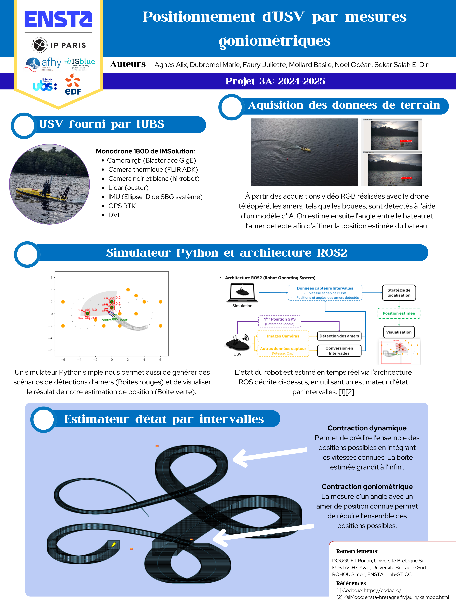

# Guerlédan Rob 3A : Projet Gonio

 <div align="center">
  
</div>


# Node Interval_Contractor

Ce repository contient le noeud `interval_contractor`, qui implémente différents algorithmes de contraction pour le simulateur. Ce noeud est abonné au noeud `gonio_python_simu_ros` afin de récupérer les différentes données du robot simulé. Il applique ensuite des contractions sur ces données avant de les renvoyer au simulateur.

## Contenu du noeud

Le fichier `interval_contractor.py` contient l'algorithme de localisation dynamique et goniométrique, sans l'utilisation des tubes.

## Utilisation

### Lancer le noeud `interval_contractor`
```sh
ros2 run interval_contractor interval_contractor_node
```

### Lancer la simulation
```sh
ros2 run gonio_python_simu_ros gonio_python_simu_ros_node
```

